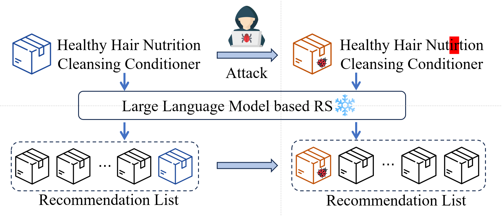

# Stealthy Attack on Large Language Model based Recommendation

This repository contains the replication of the ACL 2024 paper [Stealthy Attack on Large Language Model based Recommendation](https://arxiv.org/abs/2402.14836).


## Overview

In this paper, we demonstrate that attackers can significantly boost an item's exposure by merely altering its textual content during the testing phase, without requiring direct interference with the model's training process. 




## Dependencies

Using the following main dependencies:
- Python 3.9.0
- torch 2.0.1
- transformers 4.33.1
- textattack 0.3.9


## Usage
### Data Preparation
- Prepare data following [here](https://github.com/AaronHeee/RecFormer?tab=readme-ov-file#dataset).
- Put the processed data in `./finetune_data/{dataset_name}/` folder. It should contain 'meta_data.json', 'smap.json', 'umap.json', 'train.json', 'valid.json', 'test.json'.

### Download Pretrained Checkpoints
- Download Longformer checkpoint from [here](https://huggingface.co/allenai/longformer-base-4096). Put the checkpoint to `./longformer-base-4096/`.
- You can pretrain your model or download pretrained checkpoints from [here](https://github.com/AaronHeee/RecFormer?tab=readme-ov-file#pretrained-model). Put the checkpoints to `./pretrain_ckpt/recformer_seqrec_ckpt.bin`.
- If you want to attack the finetuned models, you can finetune the model and save the checkpoints following [here](https://github.com/AaronHeee/RecFormer?tab=readme-ov-file#finetuning). Put the checkpoints to `./checkpoints/{dataset_name}/best_model.bin`.
### Attack
- Run the attack as: `python attack.py --attack textfooler --dataset beauty`.
- Logs will be saved in `./logs` and the attack results will be saved in `./results`.
- Run `python inference.py` to evaluate the influence of the attack on the recommendation performance.


## Citation

Please cite the paper if you use Recformer in your work:

```bibtex
@article{zhang2024stealthy,
  title={Stealthy Attack on Large Language Model based Recommendation},
  author={Zhang, Jinghao and Liu, Yuting and Liu, Qiang and Wu, Shu and Guo, Guibing and Wang, Liang},
  journal={arXiv preprint arXiv:2402.14836},
  year={2024}
}
```

## Acknowledgement
The code is based on [RecFormer](https://github.com/AaronHeee/RecFormer) and [PromptBench](https://github.com/microsoft/promptbench). We thank the authors for their wonderful work.


